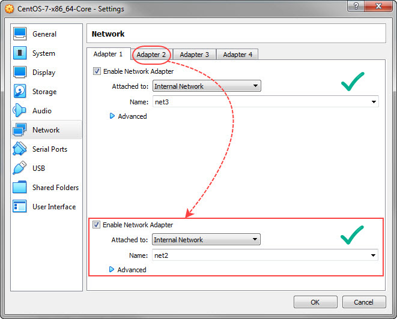
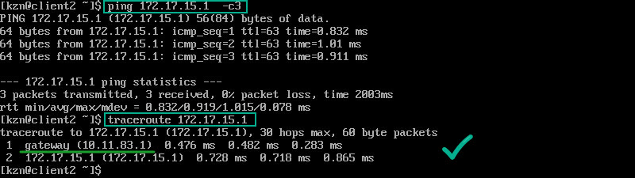

# Linux Networking Topic

The aim of workshop is creation of network using VirtualBox and solving some additional tasks

## Table of Contents

* [Topology of the configurable network](#topology-of-the-configurable-network)
* [Server configuration (Ubuntu 22.04)](#server-configuration-ubuntu-2204)
* [Client1 configuration (Ubuntu 18.04)](#client1-configuration-ubuntu-1804)
* [Client2 configuration (CentOS 7)](#client2-configuration-centos-7)
* [Traceroute: connection check between VMs](#traceroute-connection-check-between-vms)
* [Routing Task 1](#routing-task-1)
* [Routing Task 2: Summary Route](#routing-task-2-summary-route)
* [SSH Service](#ssh-service)
* [Firewall configuration on Server](#firewall-configuration-on-server)
* [NAT configuration on Server](#nat-configuration-on-server)

## Topology of the configurable network

<details><summary>Show Network scheme</summary>


Here `enp0s3`, `enp0s8` and `enp0s9` are virtual Ethernet interface.  
The ethernet identifiers can be different for real hosts.

</details>

## Server configuration (Ubuntu 22.04)

* ### VirtualBox Network settings

<details><summary>Show VB Network Adapters Config</summary>


</details>

* ### Setting permanent IP addresses to all interfaces

Following command identifies available Ethernet interfaces:

```shell
$ ls /sys/class/net
enp0s3 enp0s8 enp0s9 lo
```

Here we have `enp0s3`, `enp0s8`, `enp0s9` and `lo` is localhost.

Using `netplan` we should edit or sometimes create `/etc/netplan/*.yaml` config file.  
In our case we edit already existing `/etc/netplan/00-installer-config.yaml`:

```yaml
network:
  version: 2
  ethernets:
    enp0s3:
      dhcp4: false
      addresses: [192.168.0.150/24]
      routes:
       - to: default
         via: 192.168.0.1
      nameservers:
        addresses: [192.168.0.1, 8.8.8.8, 8.8.8.4]
    enp0s8:
      addresses: [10.83.5.1/24]
    enp0s9:
      addresses: [10.11.83.1/24]
```

Type `sudo netplan try` or `sudo netplan apply` command reloads new settings:

* ### Checking out IP forwarding

```shell
$ sysctl net.ipv4.ip_forward
net.ipv4.ip_forward = 1
```

or

```shell
$ cat /proc/sys/net/ipv4/ip_forward
1
```

The value `1` indicates that forwarding is turned on. It also indicates that the line `net.ipv4.ip_forward=1` holds uncomment state in `/etc/sysctl.conf` file.
After editting the `/etc/sysctl.conf` type `sudo sysctl --system` command to reload variables.

If forwarding needs to be enabled:

```shell
sudo sysctl -w net.ipv4.ip_forward=1
```

<!--  -->

* ### DHCP service

DHCP requires `isc-dhcp-server` package installed. Checking it out:

```shell
$ apt list isc-dhcp-server
Listing... Done
isc-dhcp-server/jammy-updates,jammy-security,now 4.4.1-2.3ubuntu2.3 amd64 [installed]
```

It's OK. Else type following:

```shell
sudo apt install isc-dhcp-server
```

Let's configure the `/etc/dhcp/dhcpd.conf` file:

```text
default-lease-time 600;
max-lease-time 7200;
#authoritative; #depends on purpose
subnet 10.83.5.0 netmask 255.255.255.0 {
        option subnet-mask 255.255.255.0;
        option routers 10.83.5.1;
        range 10.83.5.7 10.83.5.20;
        option domain-name-servers 192.168.0.1, 8.8.8.8;
        interface "enp0s8";
}
subnet 10.11.83.0 netmask 255.255.255.0 {
        option subnet-mask 255.255.255.0;
        option routers 10.11.83.1;
        range 10.11.83.13 10.11.83.20;
        option domain-name-servers 192.168.0.1, 8.8.8.8;
        interface "enp0s9";
        authoritative; #demonstration of what could be placed here
        #option domain-name "mydomain.example"; 
}
# Uncomment for a predefined address
#host Client1 {
#       hardware ethernet 08:00:27:fd:50:53;
#       fixed-address 10.83.5.7;
#}

```

Checking out addional settings in `/etc/default/isc-dhcp-server` file:

```text
# On what interfaces should the DHCP server (dhcpd) serve DHCP requests?
# Separate multiple interfaces with spaces, e.g. "eth0 eth1".
# INTERFACESv4=""
# INTERFACESv6=""
```

All is fine!

Dhcpd service should be restarted after changing of those config files:

```shell
sudo systemctl restart isc-dhcp-server.service
```

Dhcpd’s messages are being sent to syslog at `/var/log/syslog`.

* ### Checking some intermediate results of configuration

```shell
ip a
ip route
ip route -n
```

<details><summary>Show Output</summary>


</details>

## Client1 configuration (Ubuntu 18.04)

* ### Home router setup for Client1

That step is necessary for client hosts to be able to receive replies from the Internet through the home router and the Server.

We add the following settings in the web interface of our TL-WR740N home router:

<details><summary>Home TL-WR740N Router Setup Details</summary>


</details>

* ### VirtualBox Network settings for Client1

<details><summary>Show VB Network Adapters Config</summary>


</details>

* ### Setting IP addresses for Client1

Checking out avaible interfaces:

```shell
$ ls /sys/class/net
enp0s3 enp0s8 lo
```

The target `netplan` config file for editing what we have is `/etc/netplan/00-network-manager-all.yaml`:

```yaml
network:
  version: 2
  renderer: NetworkManager
  ethernets:
    enp0s3:
      dhcp4: true
    enp0s8:
      addresses: [172.16.5.1/24]
```

We can see that Ubuntu 18 uses `NetworkManager` configuration tool over the default `networkd`. So we also have a additional tool for network configure via the `nmcli` commands but we won't consider that topic.

* ### Checking out IP forwarding for Client1

```shell
$ sysctl net.ipv4.ip_forward
net.ipv4.ip_forward = 0
```

Activating forwarding:

```shell
sudo sysctl -w net.ipv4.ip_forward=1
```

<!-- The value `0` indicates that we need to uncomment line `net.ipv4.ip_forward=1` in `/etc/sysctl.conf` file. After that type `sudo sysctl --system` command. -->

* ### Checking results of configuration for Client1

1. Client1 got IP `10.83.5.7` on `enp0s3` and `172.16.5.1` on `enp0s8`
2. Client1 is able to ping host and resolve domain names via Server

```shell
ip a
ping goo.gle
```

<details><summary>Show Output</summary>


</details><br>
  
Now we can install `traceroute` and `net-tools` packages for using `traceroute` and `route` commands:

```shell
sudo apt-get install traceroute net-tools
```

```shell
ip route
route
route -n
```

<details><summary>Show Output</summary>


</details>

## Client2 configuration (CentOS 7)

* ### Home router setup for Client2

The settings are similar to [Client1 settings](#home-router-setup-for-client1) but destination LAN will be as `10.11.83.0`.

* ### VirtualBox Network settings for Client2

<details><summary>Show VB Network Adapters Config</summary>



</details>

* ### Setting IP addresses for Client2

Type `ls /sys/class/net` and then `ls /etc/sysconfig/network-scripts/`

<details><summary>Show Output</summary>


</details><br>

Network’s configuration files are placed in `/etc/sysconfig/network-scripts/`.  
File names have a format like `ifcfg-[network device name]`, e.g. `ifcfg-enp0s3`.  
We can assume that the `ifcfg-enp0s3` and `ifcfg-lo` were auto generated.  
Also we can see `ifcfg-enp0s8` file is missing.

First, let's check settings of `ifcfg-enp0s3` according to the requirements of the network:

```shell
sudo nano /etc/sysconfig/network-scripts/ifcfg-enp0s3
```
<details><summary>Show Output</summary>


</details><br>

Next, we should create connection for `enp0s3`. There are a few way to do it: use `nmtui` command (text user interface for NetworkManager) or copy `ifcfg-enp0s3` and then modify it or use `nmcli` commands like following:

```shell
nmcli conn add ifname enp0s8 type ethernet con-name "enp0s8"
nmcli conn modify "enp0s8" ipv4.addr "172.16.5.2/24" ipv4.method manual
nmcli conn up "enp0s8"
```

Double quotes could be omitted. They help to see the difference between interface names and connection names.  

After that check results:

```shell
nmcli conn show
ls /etc/sysconfig/network-scripts/
```

<details><summary>Show Output</summary>


</details><br>

New `ifcfg-enp0s8` file has appeared.

* ### Checking out IP forwarding for Client2

```shell
$ sysctl net.ipv4.ip_forward
net.ipv4.ip_forward = 0
```

The value `0` indicates that we need to add line `net.ipv4.ip_forward=1` in `/etc/sysctl.conf` file. After that type `sudo sysctl --system` command.

```shell
sudo nano /etc/sysctl.conf
```

<details><summary>Show Output</summary>


</details><br>

Or activate forwarding via:

```shell
sudo sysctl -w net.ipv4.ip_forward=1
```

* ### Checking results of configuration for Client2

1. Client2 got IP `10.11.83.13` on `enp0s3` and `172.16.5.2` on `enp0s8`
2. Client2 is able to ping hosts and resolve domain names via Server
3. Client2 is able to ping Client1 via `172.16.5.0/24`

```shell
ip a
ping goo.gle -c 1
ping 172.16.5.1 -c 1
```

<details><summary>Show Output</summary>


</details>

## Traceroute: connection check between VMs

Client1 (`10.83.5.7`/`172.16.5.1`) runs tracing route to Client2 (`10.11.83.13`/`172.16.5.2`)

We type `traceroute 10.11.83.13`, `route -n` and `traceroute 172.16.5.2`:

<details><summary>Show Output</summary>


</details><br>

In the routing table of Client1 there is no record about `10.11.83.13` or `10.11.83.0/24`. So `10.11.83.13` has the best match with prefix mask `/0` and uses default gateway `10.83.5.1` on interface `enp0s3` for next hop to the Server.  
On its turn, the Server has a record `10.11.83.0/24` what directly redirects packets via the Server's interface `enp0s8` connected to `10.11.83.13`.

The address `172.16.5.2` matches to record `172.16.5.0/24` of Client1's route table. Gateway `0.0.0.0` for `172.16.5.0/24` directly redirects packets via Client1's `enp0s9` what has a connection with `172.16.5.2`.

```shell
route -n
```

<details><summary>Show Output</summary>


</details><br>

We have a similar case with tracing from Client2 to Client1. The Server has a record `10.11.83.0/24` for `10.83.5.7`.

```shell
traceroute 10.83.5.7
traceroute 172.16.5.1
```

<details><summary>Show Output</summary>


</details><br>

When a packet is sent by `traceroute` to a host which can't forward it, that host sends an ICMP "Destination Unreachable" message to the originator, which contains a reason for the non-forwarding. On screenshot we can see it like `!X` that means "communication administratively prohibited" due to restricting access to the route tables.

## Routing Task 1

To Client1's virtual interface `lo` will be assigned two temporary IP addresses: `172.17.15.1/24` and `172.17.25.1/24`.  
The goal is to configure traffic from Client2 to `172.17.15.1` via Server and from Client2 to `172.17.25.1` by `172.16.5.0/24`.

* ### Step 1: adding IP addresses to Client1

```shell
sudo ip addr add 172.17.15.1/24 dev lo
sudo ip addr add 172.17.25.1/24 dev lo
ip addr show lo
```

<details><summary>Show Output</summary>


</details>

* ### Step 2: adding 1st route via Server

```shell
sudo ip route add 172.17.15.0/24 via 10.83.5.7
route
```

<details><summary>Show Output</summary>


</details>

* ### Step 3: adding 2nd route on Client2 and checking goals

```shell
sudo ip route add 172.17.25.0/24 via 172.16.5.1

ping 172.17.25.1 -c 3
traceroute 172.17.25.1
```

<details><summary>Show Output</summary>




</details>

## Routing Task 2: Summary Route

The goal is to calculate the shared summarizing address and mask for addresses `172.17.15.1` and `172.17.25.1` where the prefix should be as long as possible. The established routes created in the previous steps should be deleted. New merged traffic route from Client2 should pass via Server.

* ### Step 1: calculating summarizing address and mask

|addresses|binary|
|---|---|
|172.17.15.0|**10101100.00010001.000**01111.00000000|
|172.17.25.0|**10101100.00010001.000**11001.00000000|
|172.17.0.0|**10101100.00010001.000**00000.00000000|
|255.255.224.0|**11111111.11111111.111**00000.00000000|

So, summarized route will be `172.17.0.0/19`

* ### Step 2: managing routes on Server

```shell
sudo ip route del 172.17.15.0/24 via 10.83.5.7
sudo ip route add 172.17.0.0/19 via 10.83.5.7
```

<details><summary>Show Output</summary>


</details>

* ### Step 3: managing routes on Client2 and checking goals

```shell
sudo ip route del 172.17.25.0/24 via 172.16.5.1

ping 172.17.15.1 -c 2
traceroute 172.17.15.1
ping 172.17.25.1 -c 2
traceroute 172.17.25.1
```

<details><summary>Show Output</summary>


</details>
<!--
* ### Step 4 (informational): adding permanent route on Server
```yaml
network:
  version: 2
  ethernets:
    enp0s3:
      dhcp4: false
      addresses: [192.168.0.150/24]
      routes:
       - to: default
         via: 192.168.0.1 
      nameservers:
        addresses: [192.168.0.1, 8.8.8.8, 8.8.8.4]
    enp0s8:
      addresses: [10.83.5.1/24]
      routes:
       - to: 172.17.0.0/19
         via: 10.83.5.7 
    enp0s9:
      addresses: [10.11.83.1/24]
  ```
-->

## SSH Service

The goal is to configure SSH service so Client1 and Client2 could connect to Server and to each other.

* ### Step 1: Checking SSH connections

Sometimes SSH service is preinstalled in Linux. So, let's check the SSH connections

```shell
ssh kzn@10.11.83.13
exit

ssh kimmy@10.83.5.1
exit

ssh omara@10.83.5.7
exit
```

<details><summary>Show Output</summary>


</details>

* ### Step 2: Finding the reason of connection refuse for Client1 (Ubuntu 18.04)

```shell
$ systemctl is-active ssh
inactive
$ systemctl is-active sshd
inactive
$ sudo systemctl start sshd
Failed to start sshd.service: Unit sshd.service not found.
$ sudo apt install openssh-server
```

<details><summary>Show Output</summary>


</details>

* ### Step 3: Checking again the connection from Client2

```shell
ssh omara@10.83.5.7
```

<details><summary>Show Output</summary>


</details>

## Firewall configuration on Server

Following goals for this task are:

  1. Allow SSH connection for Client1 and deny for Client2
  2. From Client2 ping to `172.17.15.1` could be passed and to `172.17.25.1` is denied

Next we use the following commands on Server:

```shell
sudo iptables -A INPUT -m state --state ESTABLISHED,RELATED -j ACCEPT
sudo iptables -A INPUT -p tcp --dport ssh -s 10.11.83.13 -j DROP
sudo iptables -A INPUT -p tcp --dport ssh -s 10.83.5.7 -j ACCEPT
sudo iptables -A FORWARD -p icmp -d 172.17.15.1 -j ACCEPT
sudo iptables -A FORWARD -p icmp -d 172.17.25.1 -j DROP
```
<!-- (optional)
$ sudo iptables -A INPUT -i lo -j ACCEPT
$ sudo iptables -A INPUT -j DROP
-->

After that we are going to check accepted rules as a client host:

<details><summary>Show Output</summary>


</details><br>

Let's see `iptables` on Server:

```shell
sudo iptables -L -v
```

<details><summary>Show Output</summary>


</details><br>

We can see that 7 packets were dropped for Client2/`10.11.83.13` and 1 packet was accepted for Client1/`10.83.5.7`.

When Client2 were pinging the addresses on `lo` of Client1 via Server, 3 packets for `172.17.25.1` were dropped and the other 3 were accepted for `172.17.15.1`. 

Use `sudo iptables -F` command to flush all added rules in iptables.

## NAT configuration on Server

For this part first we need to remove previous added NAT settings at TL-WR740N home router.

<details><summary>Show Routing for TL-WR740N</summary>


</details><br>

Next, we add the following commands to the Server:

```shell
sudo iptables -t nat -A POSTROUTING -s 10.11.83.0/24  -j SNAT --to-source 192.168.0.150
sudo iptables -t nat -A POSTROUTING -s 10.83.5.0/24  -j SNAT --to-source 192.168.0.150
```

Checking results:

```shell
sudo iptables -t nat -L -v
ping goo.gle
```

<details><summary>Show Output</summary>


</details>
